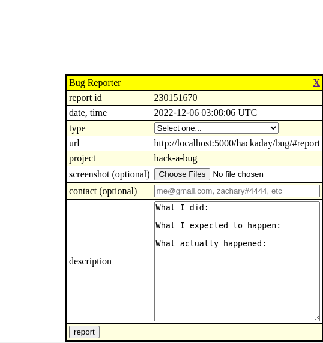

Hack-A-Day is a project I'm doing in November, where I try to make 30 new projects, in 30 days. I've extended it to december.

# Day 31: Hack-A-Bug

Day 31 is a bug reporter

Demo available [here](https://tilde.za3k.com/hackaday/bug).

Source available on [github](https://github.com/za3k/day31_bug).
